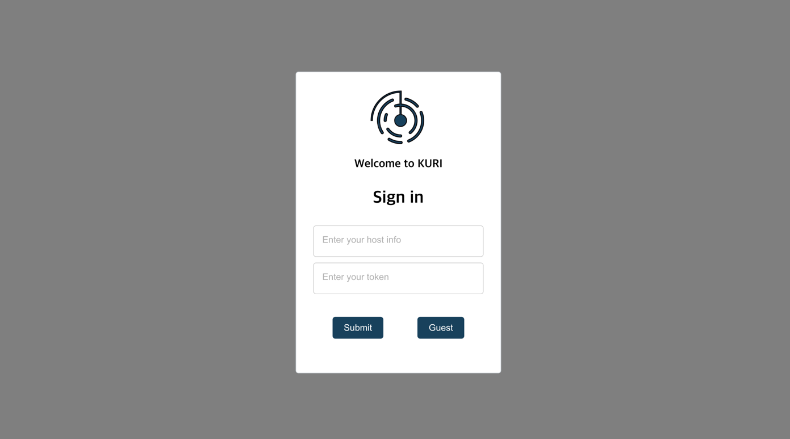
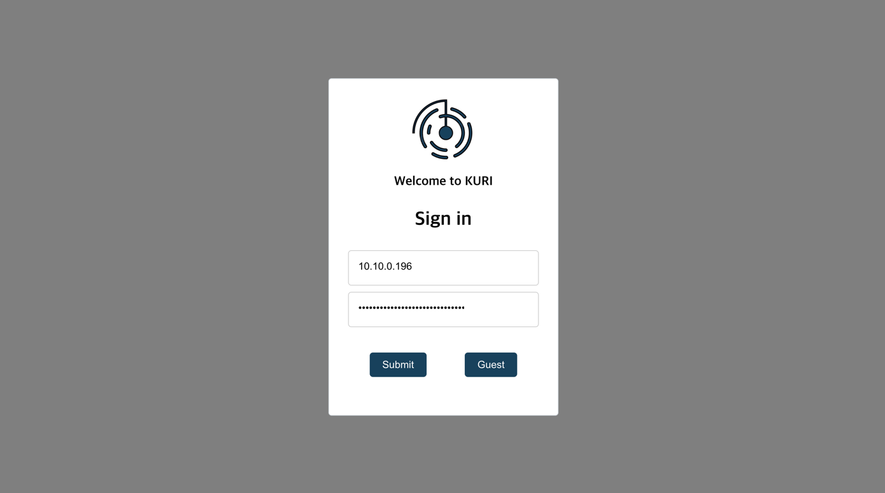
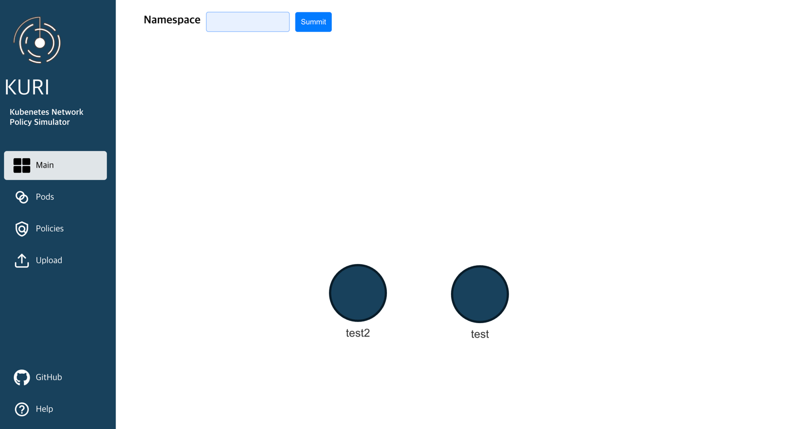
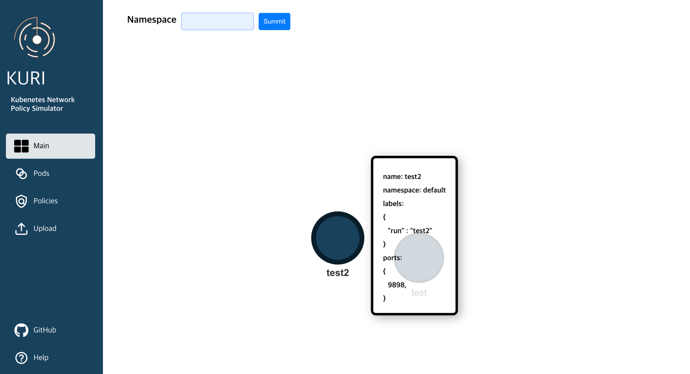
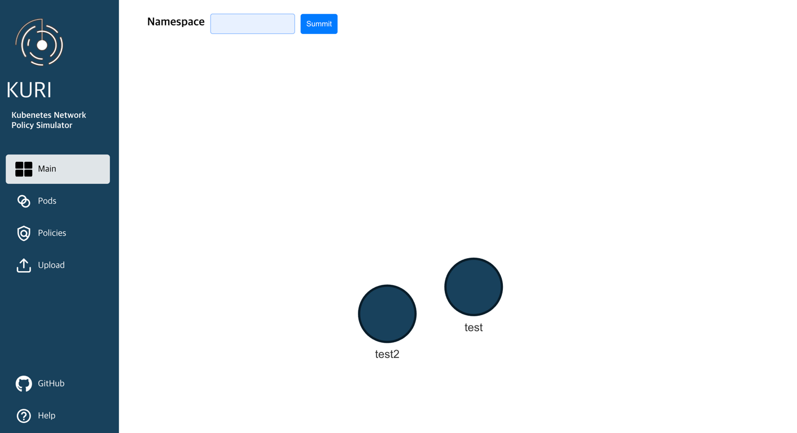
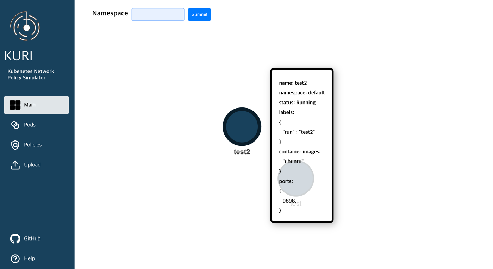
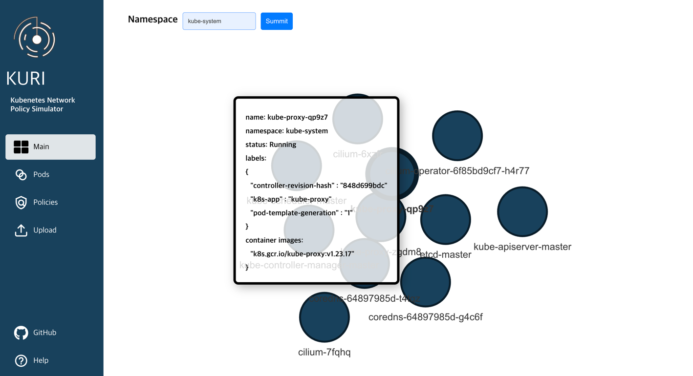

# KURI
**_KUbernetes + mRI = KURI_**
<p align="center"></p>

## KURI WebPage

> 개발기간: 2023.1 ~ 2023.2

---

<!-- 
## 프로젝트 소개
KURI는 Kubernetes network policy 적합성을 검사하는 웹사이트입니다.
<br>
pod에 대한 웹사이트
-->


## 주요 기능
### 1. ~~Kubernetes Policy Verification System~~ **(ongoing)**
   - kubernetes network policy를 입력받아, 그것의 적합성을 판단합니다.
    <br> 이를 통해 사용자는 입력한 network policy를 실제 kubernetes 환경에 반영할 지 결정할 수 있습니다.
   
<br>

### 2. pod visibility (graph)
   - kubernetes 클러스터의 pod 정보를 가져와, 이를 시각화할 수 있습니다. (namespace 선택 가능) 

---

## 시작하기

### Requirements

프로젝트를 사용하기 전, k8s 클러스터에 접근하기 위한 token과 유효한 host를 준비해야 합니다.

### Installation
```shell
$ git clone https://github.com/1006lem/kuri.git
$ cd kuri

# start backend service
$ cd backend
$ go run .

# start frontend service
$ cd ../frontend
$ npm start
```

---

## 데모

<p align="center"></p>
<p align="center"></p>
<p align="center"></p>
<p align="center"></p>
<p align="center"></p>
<p align="center"></p>
<p align="center"></p>


---


## 프로젝트 구성원

<table>
  <tr>
    <td height="140px" align="center"> <a href="https://github.com/Lee-Coderrr"><br/></a></td>
    <td height="140px" align="center"> <a href="https://github.com/peachpotato6"><br/></a></td>
    <td height="140px" align="center"> <a href="https://github.com/kyuchory"><br/></a></td>
    <td height="140px" align="center"> <a href="https://github.com/1006lem"><br/></a></td>
  </tr>
  <tr>
    <td align="center"> 👦🏻 이동주 (인프라, 리더)</td>
    <td align="center"> 👦🏻 류경표 (프론트엔드)</td>
    <td align="center"> 👦🏻 신규철 (백엔드)</td>
    <td align="center"> 👦🏻 김규민 (백엔드)</td>
  </tr>
</table>


<br>